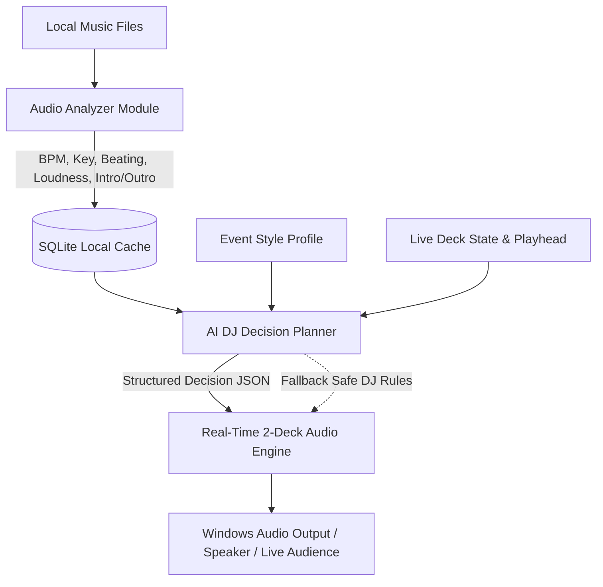

# AI DJ – Autonomous Live DJ: Architecture & Specification

## 1. System Overview & Core Philosophy

**AI DJ** is an autonomous, live-performance DJ mixing desktop application designed for single-laptop live events with local music and zero internet dependency.

### Core Architectural Rule:
> **Never ask an LLM or remote service to process raw audio samples.**
> Audio is strictly processed locally by a deterministic pipeline:
>
> `Local Music` ➔ `Audio Analyzer (FFmpeg/Essentia/Librosa)` ➔ `Structured Musical DB (SQLite)` ➔ `AI DJ Decision Planner` ➔ `Structured Decision JSON` ➔ `Real-Time Two-Deck Audio Engine` ➔ `Windows Default Audio Device / Speakers`



---

## 2. Directory Layout & Module Responsibilities

```
ai-dj/
├── frontend/             # React 19 + TypeScript + Vite modern DJ Console & Stage HUD
│   ├── src/
│   │   ├── components/   # Deck, Mixer, WaveformDisplay, AIDecisionCenter, Library, LiveEventOverlay
│   │   ├── types/        # DJ telemetry, track, decision & state interfaces
│   │   └── utils/        # Camelot wheel logic, audio calculations
├── ai-engine/            # Autonomous playlist selection, harmonic mixing & energy progression planner
│   ├── planner.py        # Autonomous decision maker (evaluates key compatibility, energy curves)
│   └── transitions.py    # Transition strategies (beat match, EQ bass swap, filter sweep, echo out)
├── audio-engine/         # Web Audio API / AudioWorklet & native audio mixing engine
│   ├── deck.ts           # Sample playback, pitch shifting, cueing, looping
│   └── mixer.ts          # 3-band biquad EQ, resonant state-variable filters, crossfader curves
├── analyzer/             # Offline batch & real-time track feature extraction
│   ├── extract.py        # BPM, beat grid, Camelot musical key, energy, intro/outro detection
│   └── waveform.py       # Multi-band frequency peak generation for 60FPS display
├── database/             # Persistent local storage
│   ├── schema.sql        # Tracks, waveforms, cue points, playlists, analysis cache
│   └── db.py             # SQLite data access layer
├── shared/               # Shared JSON schemas, protocol contracts and transition definitions
│   └── protocol.json     # Standardized AI Decision command schema
├── tests/                # Unit & integration test suites
│   ├── test_planner.py   # AI decision determinism & safety tests
│   └── test_audio.py     # Buffer continuity & zero-silence tests
├── docs/                 # System architecture & live event runbooks
└── src-tauri/            # Tauri desktop wrapper & Windows native audio routing
```

---

## 3. Structured Decision Protocol Contract

The AI DJ Planner produces strictly typed decisions:

```json
{
  "timestamp": 1727608200,
  "current_deck": "A",
  "next_deck": "B",
  "next_track": {
    "id": "trk-2",
    "title": "Vaathi Raid (DJ Bass Boost)",
    "file_path": "C:/Music/Vaathi_Raid_Remix.mp3",
    "bpm": 132.0,
    "key": "9A"
  },
  "transition": {
    "type": "eq_bass_swap",
    "transition_bars": 16,
    "cue_in_seconds": 12.0,
    "mix_out_start_seconds": 204.0,
    "target_bpm": 132.0,
    "target_energy": 0.91
  },
  "fallback_strategy": "smooth_crossfade"
}
```

---

## 4. Safety & Fail-Safe Architecture

1. **Zero Silence Guarantee**: If the AI planner is delayed or encounters an unexpected exception, the audio engine continues playing the active deck and falls back to a deterministic 8-bar crossfade rule.
2. **Missing Track Recovery**: If a scheduled track fails to load from disk, the engine instantly skips to the next compatible cached track in the library without interrupting playback.
3. **Emergency Red Stop**: An illuminated crimson panic button triggers an immediate safe fade-out or instant mute with confirmation.
4. **Local Offline-First**: Zero external network API calls required for playback, library browsing, or autonomous mixing.
